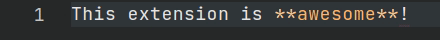

<h1 align="center">
   
    
   
	 
  Marky Markdown
   
   
</h1>
<h4 align="center">Markdown editing. Redefined.</h4>

This is an extension pack of related markdown extensions (that I wrote), which add rich editing powers to markdown documents.

The advantage that this extension pack has over an extension such as [Markdown All in One](https://marketplace.visualstudio.com/items?itemName=yzhang.markdown-all-in-one) is that you can disable features by disabling a particular extension. You can go a step further and choose to only install the extensions you want. This gives you a similar feature set but with a lot more control.

## Extensions

1. [Marky Edit](https://marketplace.visualstudio.com/items?itemName=robole.marky-edit): Toggle-style editing.
1. [Marky Dynamic](https://marketplace.visualstudio.com/items?itemName=robole.marky-dynamic): Automate updating dynamic content such as Table of Contents.
1. [Markdown Snippets](https://marketplace.visualstudio.com/items?itemName=robole.markdown-snippets): Snippets for extended markdown syntax.
1. [Marky Stats](https://marketplace.visualstudio.com/items?itemName=robole.marky-markdown): Add stats to the status bar.

## Activation

These extensions are only loaded when a markdown file is open. To be more specific, the [activation event](https://code.visualstudio.com/api/references/activation-events) is `onLanguage: markdown`.

## Commands

The following commands can be run from the Command Palette (`Ctrl+Shift+P`):
1. `Marky Edit: Toggle Delete (Strikethrough)`
1. `Marky Edit: Toggle Emphasis (Italic)`
1. `Marky Edit: Toggle Fenced Code Block`
1. `Marky Edit: Toggle Heading 1`
1. `Marky Edit: Toggle Heading 2`
1. `Marky Edit: Toggle Heading 3`
1. `Marky Edit: Toggle Heading 4`
1. `Marky Edit: Toggle Heading 5`
1. `Marky Edit: Toggle Heading 6`
1. `Marky Edit: Toggle Horizontal Rule`
1. `Marky Edit: Toggle Image`
1. `Marky Edit: Toggle Inline Code`
1. `Marky Edit: Toggle Link`
1. `Marky Edit: Toggle Ordered List (Bulleted List)`
1. `Marky Edit: Toggle Quote`
1. `Marky Edit: Toggle Strong Emphasis (Bold)`
1. `Marky Edit: Toggle Unordered List (Numbered List)`
1. `Marky Dynamic: Add/Update the Table of Contents (TOC)`
1. `Marky Dynamic: Remove the Table of Contents (TOC)`
1. `Marky Dynamic: Add/Update Heading Bookmarks`
1. `Marky Dynamic: Remove Heading Bookmarks`
1. `Marky Dynamic: Add/Update Section Numbering`
1. `Marky Dynamic: Remove Section Numbering`
1. `Marky Stats: Select Stat`

See individual extensions for up-to-date list.

## Major Features Overview

### 1) Toggle-style editing

Toggle-style editing offers a more natural editing experience. It enables you to mark or unmark text as you type, and insert markdown fragments as snippets for simple completion.

For more information, see [Marky Edit](https://marketplace.visualstudio.com/items?itemName=robole.marky-edit).

### 2) Dynamic content

Editing and reformating documents can leave content such as table of contents out of sync with the rest of the document. This extension enables you to update the table of contents when you save the document.

For more information, see [Marky Dynamic](https://marketplace.visualstudio.com/items?itemName=robole.marky-dynamic).

### 3) Markdown Snippets

Provides snippets for extended markdown syntax.

For more information, see [Markdown Snippets](https://marketplace.visualstudio.com/items?itemName=robole.markdown-snippets).

### 4) Document Stats

A stat about the document is added to the status bar. By default, it is the *Reading Time*.

You can choose an alternative stat by clicking the status bar item, and selecting from the quickpick menu.

For more information, see [Marky Stats](https://marketplace.visualstudio.com/items?itemName=robole.marky-markdown).

## Extension Settings

You will find options for these extensions by searching for "marky".

## Installation

1. The extension is listed in the [VS Code Marketplace](https://marketplace.visualstudio.com/items?itemName=robole.marky-markdown) and [Open VSX Marketplace](https://open-vsx.org/extension/robole/marky-stats) where you can download or install it directly.
1. Inside VS Code: Type `Ctrl+P`, write `ext install robole.marky-markdown` in the text field, and hit `Enter`.
1. From the Command-line: Run the command `code --install-extension robole.marky-markdown`.

## Show gratitude

If you are happy with the extension, please star the repo, and leave a review to help others find it. 🌟

You can [buy me a coffee](https://ko-fi.com/roboleary) if you would like to support me in my quest to make more great open-source software. ☕🙏
