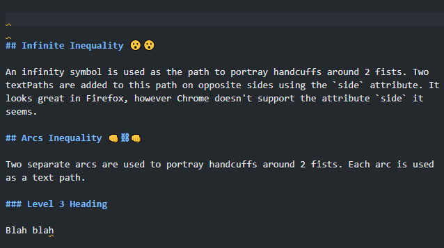
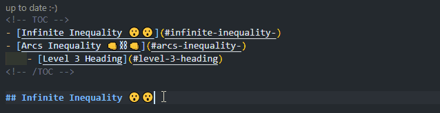
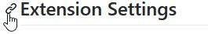
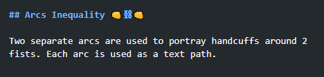

# Marky Markdown

A funky bunch of methods for writing markdown more easily. ✍😎

<!-- TOC -->
- [Commands](#commands)
- [Features](#features)
	- [1. Manage a Table of Contents (TOC)](#1-manage-a-table-of-contents-toc)
	- [2. Manage Heading Bookmark Links](#2-manage-heading-bookmark-links)
- [Extension Settings](#extension-settings)
- [Installation](#installation)
- [Known Issues](#known-issues)
- [Feature Wishlist](#feature-wishlist)
<!-- /TOC -->

## Commands

The following commands can be run from the Command Palette (`Ctrl+Shift+P`):

1. `Marky Markdown: Add/Update the Table of Contents (TOC)`
1. `Marky Markdown: Remove the Table of Contents (TOC)`
1. `Marky Markdown: Add/Update Heading Bookmark Links`
1. `Marky Markdown: Remove Heading Bookmark Links`

## Features

### 1. Manage a Table of Contents (TOC)

A table of contents (TOC) is a list of links to the headings within your document. It makes it easier to navigate to different sections of your document.

The command `Marky Markdown: Add/Update the Table of Contents (TOC)` will add a TOC **at the cursor position in the active markdown document**. If the TOC exists already, it will be updated.

It does the following:

- Searches for open and closed ATX- style headings (which use hashes).
- **Includes headings levels 2 through 6 by default.** You can change this in the Settings through the `Marky Markdown › Heading: Level Range` option.
- It creates TOC links excluding bookmark links.
- It adds a CodeLens entry to the top of the TOC indicating if it is up-to-date with the document. You can click this entry to update the TOC.

**You can choose to have the TOC update automatically whenever the document is saved by enabling the `Marky Markdown › Table Of Contents: Update On Save` option in the Settings**. The performance is good, it will not be an issue if you have [Autosave](https://code.visualstudio.com/docs/editor/codebasics#_save-auto-save) set to save "after a delay" of approximately 1 second, but you should be mindful of what other extensions are up to!

You can also choose to add a label to the top of the TOC by editing the `Marky Markdown › Table Of Contents: Label` option in the Settings.

The command `Marky Markdown: Remove a Table of Contents (TOC)` will remove the TOC.

### 2. Manage Heading Bookmark Links

It is helpful to readers to have a link in headings for bookmarking different sections of a document. You probably have seen this done automatically by Github to `readme.md` files, like in the image below.

 

The command `Marky Markdown: Add/Update Heading Bookmark Links` will add bookmark links to the headings in the **active markdown document**.

It does the following:

- Searches for open and closed ATX-style headings (which use hashes).
- **Includes headings levels 2 through 6 by default.** You can change this in the Settings through the `Marky Markdown › Heading: Level Range` option.
- By default, it will add a link with the text '**∞**', this is the infinity character, which looks like a link! In the Settings, you can customise this text (`Marky Markdown › Heading: Link Text`), or specify an image (`Marky Markdown › Heading: Link Image Path`). If you provide text and an image, the image will come first.

The command `Marky Markdown: Remove Heading Bookmark Links` will remove the bookmark links.

## Extension Settings

These settings can be applied to the User and the Workspace. The Workspace values take precedence over the User values.

| Name                                               | Type    | Enum Values          | Default | Description                                                                                                                                                                                                                                 |
| -------------------------------------------------- | ------- | -------------------- | ------- | ------------------------------------------------------------------------------------------------------------------------------------------------------------------------------------------------------------------------------------------- |
| Marky Markdown › Heading: Level Range              | String  |                      | "2..6"  | Select the range of heading levels (from most important to least important) to which Commands are applied. For example, the range of '2..6' includes headings from level 2 to level 6.                                                      |
| Marky Markdown › Heading: Link Text                | String  |                      | ∞       | Customize the text of the heading bookmark links.                                                                                                                                                                                           |
| Marky Markdown › Heading: Link Image Path          | String  |                      | ""      | Add an image to the heading bookmark link. If both text and an image are specified, the image will come first.                                                                                                                              |
| Marky Markdown › Heading: Slugify Mode             | String  | ['github', 'gitlab'] | github  | Creates a formatted version of the heading text that can be used as an ID, this is used as a fragment URL in links. Vendors have different implementations, and produce different slugs. The text from links are included in slugification. |
| Marky Markdown › Table Of Contents: Label          | String  |                      | ""      | Add a label to the top of the Table of Contents.                                                                                                                                                                                            |
| Marky Markdown › Table Of Contents: Update On Save | Boolean |                      | false   | Update the Table of Contents automatically when the document is saved.                                                                                                                                                                      |

## Installation

1. Inside VS Code: Type `Ctrl+P`, write `ext install robole.marky-markdown` in the text field, and hit `Enter`.
1. From the Command-line: Run the command `code --install-extension robole.marky-markdown`.
1. From the [VS Marketplace](https://marketplace.visualstudio.com/items?itemName=robole.marky-markdown): Click the _Install_ button.

## Known Issues

None.

## Feature Wishlist

1. Exclude trailing space for closed ATX-style headings in TOC.
1. Give the option in settings to update the bookmark links when saving the document.
1. Add/update/remove numbering to headings.
1. Shortcuts for editing (bold, italics..etc)?
