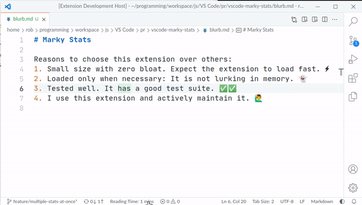

# Marky Markdown

This extension gives you **rich editing powers** for markdown documents, and enables you to **automate** the update of dynamic content.

Reasons to choose this extension:
1. **Modular design**. This is an Extension Pack. Related features are divided into separate extensions. Don't want all of the features? Then, only install the specific extensions you want! 📦📦📦
1. **Small size with zero bloat**: Many extensions include unnecessary files in the extension and do not optimize the resources. Expect this extension to load fast. ⚡
1. **Loaded only when necessary**: It is loaded only when you have markdown documents open. Some extensions are loaded for every project with a README, lurking in memory never to be used! 👻
1. **Tested well**. The extensions have test suites, it is alarming how many extensions have zero tests! ✔
1. **Actively Maintained**. I use this. 🙋‍♂️🙂

<!-- TOC -->
**Table of Contents**
- [Extensions](#extensions)
- [Commands](#commands)
- [Features Overview](#features-overview)
	- [1) Toggle-style editing](#1-toggle-style-editing)
	- [2) Manage a Table of Contents (TOC)](#2-manage-a-table-of-contents-toc)
	- [3) Manage Heading Bookmarks](#3-manage-heading-bookmarks)
	- [4) Manage Section Numbering](#4-manage-section-numbering)
	- [5) Markdown Snippets](#5-markdown-snippets)
	- [6) Document Stats](#6-document-stats)
- [Extension Settings](#extension-settings)
- [Installation](#installation)
<!-- /TOC -->

## Extensions

1. [Marky Edit](https://marketplace.visualstudio.com/items?itemName=robole.marky-edit): Toggle-style editing.
1. [Marky Dynamic](https://marketplace.visualstudio.com/items?itemName=robole.marky-dynamic): Automate dynamic content such as Table of Contents and Section Numbering.
1. [Markdown Snippets](https://marketplace.visualstudio.com/items?itemName=robole.markdown-snippets): Snippets for extended markdown syntax.
1. [Marky Stats](https://marketplace.visualstudio.com/items?itemName=robole.marky-stats): Add a stat status bar item.

## Commands

The following commands can be run from the Command Palette (`Ctrl+Shift+P`):
1. `Marky Edit: Toggle Delete (Strikethrough)`
1. `Marky Edit: Toggle Emphasis (Italic)`
1. `Marky Edit: Toggle Fenced Code Block`
1. `Marky Edit: Toggle Heading 1`
1. `Marky Edit: Toggle Heading 2`
1. `Marky Edit: Toggle Heading 3`
1. `Marky Edit: Toggle Heading 4`
1. `Marky Edit: Toggle Heading 5`
1. `Marky Edit: Toggle Heading 6`
1. `Marky Edit: Toggle Horizontal Rule`
1. `Marky Edit: Toggle Image`
1. `Marky Edit: Toggle Inline Code`
1. `Marky Edit: Toggle Link`
1. `Marky Edit: Toggle Ordered List (Bulleted List)`
1. `Marky Edit: Toggle Quote`
1. `Marky Edit: Toggle Strong Emphasis (Bold)`
1. `Marky Edit: Toggle Unordered List (Numbered List)`
1. `Marky Dynamic: Add/Update the Table of Contents (TOC)`
1. `Marky Dynamic: Remove the Table of Contents (TOC)`
1. `Marky Dynamic: Add/Update Heading Bookmarks`
1. `Marky Dynamic: Remove Heading Bookmarks`
1. `Marky Dynamic: Add/Update Section Numbering`
1. `Marky Dynamic: Remove Section Numbering`
1. `Marky Stats: Select a Statistic for the Status Bar`

## Features Overview

### 1) Toggle-style editing

For more information, see [Marky Edit](https://marketplace.visualstudio.com/items?itemName=robole.marky-edit).

### 2) Manage a Table of Contents (TOC)

The command `Marky Dynamic: Add/Update the Table of Contents (TOC)` will add a table of contents (TOC) **at the cursor position in the active markdown document**. If the TOC exists already, it will be updated.

The command `Marky Dynamic: Remove the Table of Contents (TOC)` will remove the TOC.

For more information, see [Marky Dynamic](https://marketplace.visualstudio.com/items?itemName=robole.marky-dynamic).

### 3) Manage Heading Bookmarks

The command `Marky Dynamic: Add/Update Heading Bookmarks` will add bookmarks to the headings in the **active markdown document**.

By default, it will add a link with the text '**∞**', this is the infinity character, which looks like a link! In the Settings, you can customise this text or specify an image.

The command `Marky Dynamic: Remove Heading Bookmarks` will remove the bookmark links.

For more information, see [Marky Dynamic](https://marketplace.visualstudio.com/items?itemName=robole.marky-dynamic).

### 4) Manage Section Numbering

The command `Marky Dynamic: Add/Update Section Numbering` will add section numbers to the headings in the active markdown document.

The command `Marky Dynamic: Remove Section Numbering` will remove the section numbers.

For more information, see [Marky Dynamic](https://marketplace.visualstudio.com/items?itemName=robole.marky-dynamic).

### 5) Markdown Snippets

I recommend installing the [Snippets Ranger](https://marketplace.visualstudio.com/items?itemName=robole.snippets-ranger) extension. This gives you an easy up-to-date view of all of the snippets available.

For more information, see [Markdown Snippets](https://marketplace.visualstudio.com/items?itemName=robole.markdown-snippets).

### 6) Document Stats

A stat for the document is added to the status bar. By default, it is the *Reading Time*.

You can choose an alternative stat by clicking the status bar item, and selecting from the quickpick menu.

For more information, see [Marky Stats](https://marketplace.visualstudio.com/items?itemName=robole.marky-stats).

## Extension Settings

These settings can be applied to the User and the Workspace. The Workspace values take precedence over the User values.

| Name                                            | Type    | Enum Values          | Default | Description                                                                                                                                                                                             |
| ----------------------------------------------- | ------- | -------------------- | ------- | ------------------------------------------------------------------------------------------------------------------------------------------------------------------------------------------------------- |
| Marky Markdown › Bookmarks: Level Range         | String  |                      | "2..6"  | Select the range of heading levels (from most important to least important) to which bookmarks are managed. For example, the range of '2..6' includes headings from level 2 to level 6.                 |
| Marky Markdown › Bookmarks: Link Image Path     | String  |                      | ""      | Add an image to the heading bookmark link. If both text and an image are specified, the image will come first.                                                                                          |
| Marky Markdown › Bookmarks: Link Text           | String  |                      | "∞"       | Customize the text of the heading bookmark links.                                                                                                                                                       |
| Marky Markdown › Section Numbering: Level Range         | String  |                      | "2..6"  | Select the range of heading levels (from most important to least important) for section numbers to be managed. For example, the range of '2..6' includes headings from level 2 to level 6.                 |
| Marky Markdown › Slugify Style                  | String  | "github", "gitlab" | "github"  | Creates a formatted version of the heading text that can be used as an ID, this is used as a fragment URL in links. Vendors produce slugs that are formatted differently.                               |
| Marky Markdown: Statistic Status Bar Item | String | "Reading Time", "Words", "Lines", "Characters" | "Reading Time" | Choose the statistic item that is shown in the status bar. |
| Marky Markdown › Table Of Contents: Label       | String  |                      | ""      | Add a label to the top of the Table of Contents.                                                                                                                                                        |
| Marky Markdown › Table of Contents: Level Range | String  |                      | "2..6"  | Select the range of heading levels (from most important to least important) to which are included in the Table of Contents. For example, the range of '2..6' includes headings from level 2 to level 6. |
| Marky Markdown › Table of Contents: List Type                 | String  | "unordered list", "ordered list" | "unordered list"  | The type of list for arranging the Table of Contents                               |
| Marky Markdown › Update On Save                 | Boolean |                      | false   | Update the Bookmarks, Table of Contents, and Section Numbers automatically when the document is saved.                                                                                                                    |

## Installation

1. Inside VS Code: Type `Ctrl+P`, write `ext install robole.marky-markdown` in the text field, and hit `Enter`.
1. From the Command-line: Run the command `code --install-extension robole.marky-markdown`.
1. From the [VS Marketplace](https://marketplace.visualstudio.com/items?itemName=robole.marky-markdown): Click the _Install_ button.
